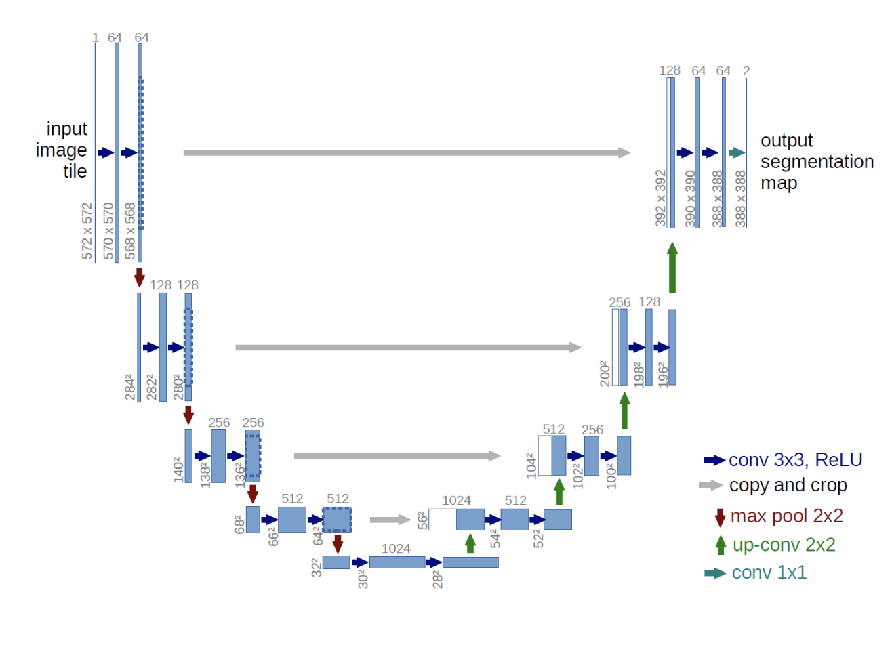
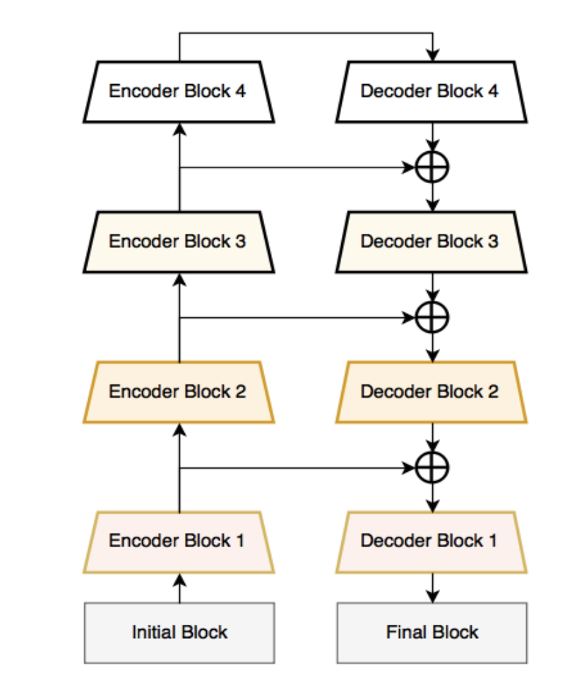
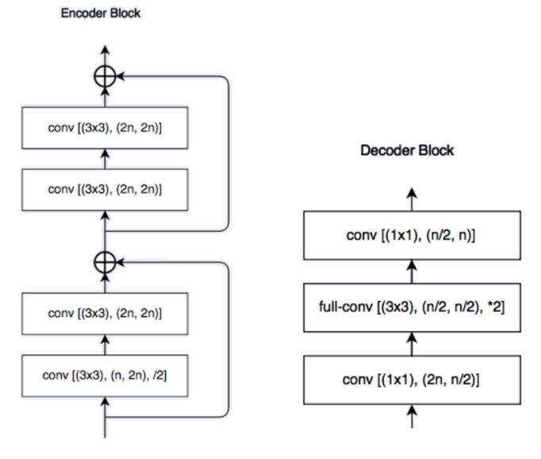
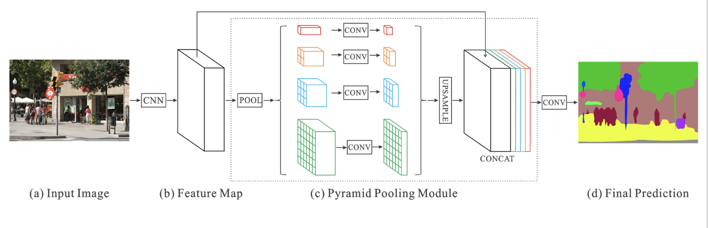
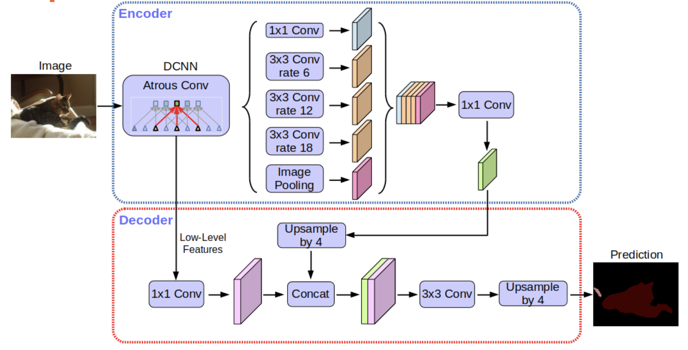
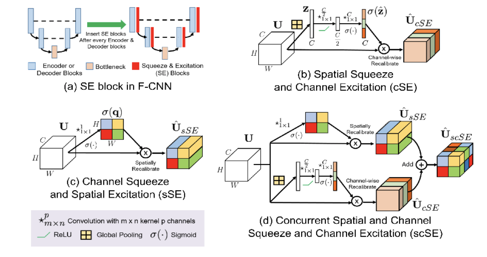
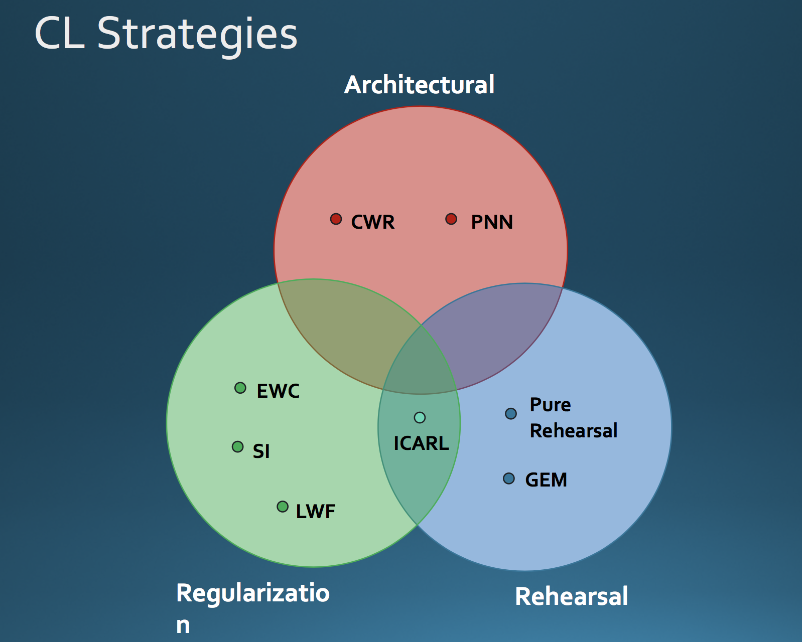

# Computer visioners conference
October 6, 2018, Kiiv

https://www.aibooster.com.ua/cv2018/

## Image Segmentation: From space to cells with stop at the showroom

### by Eugene Khvedchenya

[Presentation](https://docs.google.com/presentation/d/1y_FQIFfGdM0IjXSvjOE4FWY7IEbglYOkeRXO2P71NcA/edit#slide=id.g40dca13138_0_36)

What are the modest neural network architectures for binary, multiclass and instance segmentation? During the talk we will learn how to segment object from the background, find vehicles on satellite imagery and count nuclei cells on the radiology photography

### Types of segmentation:

- binary (assign each pixel to 1 of 2 classes)
- semantic (n classes)
- instance (each object)
- 3d segmentation

### 2015 U-Net

[Paper](https://arxiv.org/pdf/1705.08790)



- encoder-decoder architecture + shortcut connections
- binary segmentation
- size-agnostic
- not for semantics?
- High GPU footprint
- takes long time to train
- 2015 SOTA for medical image segmentation

### 2017 LinkNet

[Paper](https://arxiv.org/pdf/1707.03718.pdf)




- encoder-decoder architecture + shortcut connections
- small GPU footprint
- fast inference

### 2017 PSPNet

[Paper](https://arxiv.org/pdf/1612.01105.pdf)



- Pyramid pooling instead of decoder
- Long to train
- Slow inference
- SOTA on ImageNet Scene Parsing Challenge 2016 

### 2017 DeepLab V3+

[Paper](https://arxiv.org/pdf/1706.05587.pdf)




### Trends 2018

- Dilated convolutions
- Attention: https://openreview.net/pdf?id=Skft7cijM
- Squeeze & Excitation: https://arxiv.org/pdf/1709.01507


- Depthwise separable conv: https://arxiv.org/pdf/1610.02357.pdf
- Object context: [Paper](https://arxiv.org/pdf/1809.00916)

### Training tips and tricks

Data augmentation library

- https://github.com/albu/albumentations


Lossses:

- Focal loss
- Soft Dice/Jaccard
- Dice loss: https://arxiv.org/pdf/1707.03237.pdf 
- Lovasz loss: https://arxiv.org/pdf/1705.08790

Training:

- Stochastic weight averaging: https://arxiv.org/pdf/1803.05407.pdf
- Snapshot Ensembling: https://arxiv.org/pdf/1704.00109.pdf
- A DISCIPLINED APPROACH TO NEURAL NETWORK HYPER-PARAMETERS:
https://arxiv.org/pdf/1803.09820.pdf

### Inference tips and tricks

- Test-time augmentation
- Probability calbration (precision-recall thresholding)
- CRF 

### Datasets

* LUNA16
* COCO
* PASCAL VOC
* INRIA AERIAL
* Mapillary Vistas


## Visual Navigation in challenging environments using Deep Learning
### by Pedro Porto Buarque de Gusmão

We will have a comprehensive overview on the previous state of the art and talk about deep learning approaches to visual odometry and SLAM in the context of firefighters (low visibility, smoke, etc).

Our goal is to build an authomatic firefighter.

https://www.nist.gov/ctl/pscr/pervasive-accurate-and-reliable-lbs-emergency-responders

3 modalities for navigation:

- visual: based on sequence of images
- gyro (internal)
- magneto-inductive

### Visual navigation

[SLAM](https://en.wikipedia.org/wiki/Simultaneous_localization_and_mapping) (Simultaneous localization and mapping). 

* feature-based. The goal is to get rotation matrix and translation vector from matching features of two consecutive frames.
	* [ORB-SLAM](http://webdiis.unizar.es/~raulmur/orbslam/)
	* [ORB-SLAM Github](https://github.com/raulmur/ORB_SLAM2)
	* problem: featureless scenes, e.g. white walls.
* Classical monocular VO
	* 	feature extraction
	*  feature matching
	*  geom constraints
	*  estimate 3d points
	*  ...
* deep learning approach
	* [DeepVO](https://www.cs.ox.ac.uk/files/9026/DeepVO.pdf)
	* [sourcecode](https://github.com/ildoonet/deepvo)
	* improve global consistency
	* geometry aware
	* window loss
	* conditional loss
	* corriculum learning: https://ronan.collobert.com/pub/matos/2009_curriculum_icml.pdf
* datasets:
	* [KITTI dataset for visual odometry](http://www.cvlibs.net/datasets/kitti/eval_odometry.php) - mono 
	* [Malaga Urban Dataset](https://www.mrpt.org/MalagaUrbanDataset) - stereo

### Predicting depth with deep learning

[GANVO](https://arxiv.org/abs/1809.05786) - Unsupervised Deep Monocular Visual Odometry and Depth Estimation with Generative Adversarial Networks

Smoke is a problem
Thermal camera problems:

- less features
- no datasets
- constant recalibration

Solution: combine stereo camera with thermal camera and other types of navigation (magneto-inductive, GPS, etc.)


## Items recognition for retail with one-shot learning
### by Sergiy Koshel
We will see how to build a custom computer vision system from scratch and how to deal with the lack of training data.

The obstacle is amount of data available
One-shot learning: one image per class to train.

### Seamese one-shot learniners

- https://github.com/Goldesel23/Siamese-Networks-for-One-Shot-Learning
- https://www.cs.cmu.edu/~rsalakhu/papers/oneshot1.pdf
- https://sorenbouma.github.io/blog/oneshot/

Idea is to train network to assign objects to the same or different categories. Network is trained to compare images.

Contains several two or more identical networks with the same weights and hyper-params.

They compared three loss functions for SN:

- Contrastive loss: [LeCun 2006](http://yann.lecun.com/exdb/publis/pdf/chopra-05.pdf)
- [Triplet loss](https://towardsdatascience.com/siamese-network-triplet-loss-b4ca82c1aec8)
	- [Triplet Loss and Online Triplet Mining in TensorFlow](https://omoindrot.github.io/triplet-loss)
	- [In Defense of the Triplet Loss for Person Re-Identification](https://arxiv.org/pdf/1703.07737.pdf)
- BCE loss (their approach)

result: triplet loss max accuracy and drops faster during training.
Contrastive loss gives better precision-recall.

### Dataset:

- [Amsterdam Library of Object Images (ALOI)](http://aloi.science.uva.nl)
	- we preprocessed it by GrabCut to extract foreground
	- augmentation by adding random background and rotations

GPU heavy training

### Evaluation 

1. Academic eval: Precision-recall, f-score
2. production eval: fp, fn, tp, tn

Threshold of cosine similarity between two embedding vectors of images.

conclusion:

- fp rate increases with bigger support set size
- production-like evaluation is must have
- simple loss performs comparable to more complex ones

recommended papers:

- https://arxiv.org/abs/1608.06037
	- https://github.com/Coderx7/SimpleNet
- https://arxiv.org/abs/1712.07628
- https://arxiv.org/abs/1705.02364
	- https://github.com/facebookresearch/InferSent

## Workshop: Continual/Lifelong Leaning with Deep Architectures
by Vincenzo Lomonaco
Continual Learning (CL) is a fast emerging topic in AI concerning the ability to efficiently improve the performance of a deep model over time, dealing with a long (and possibly unlimited) sequence of data/tasks. In this workshop, after a brief introduction of the subject, we’ll analyze different Continual Learning strategies and assess them on common Vision benchmarks. We’ll conclude the workshop with a look at possible real world application of CL.

https://docs.google.com/presentation/d/1gIWzc0Cn3g7v3A4ZSXWj1Kt_R168wK0fIzWmRRRcUz0/edit#slide=id.p14

https://github.com/ContinualAI/colab/blob/master/notebooks/intro_to_continual_learning.ipynb

https://colab.research.google.com/github/ContinualAI/colab/blob/master/notebooks/intro_to_continual_learning.ipynb

### Continual Learning (CL)

https://www.continualai.org

* Higher and realistic time-scale where data (and tasks) become available only during time.
* No access to previously encountered data.
* Constant computational and memory resources.
* Incremental development of ever more complex knowledge and skills.

Problem:
- catastrofic forgetting



Rehersal: store data in external memory

Elastic Weights Consolidation (EWC)

permuted MNIT dataset
https://papers.nips.cc/paper/5059-compete-to-compute

we will take a look at three different strategies:

* **Naive strategy**, is the simple idea of continuing the back-prop process on the new batches/tasks. This is very simple, but at the same time very prone to forgetting
* **Rehearsal strategy**: to carry on all or part of the previously encountered examples (of the previous tasks), shuffling them with the data of the current task. Using all the past data is near to the optimal performance we can desire at the end of the task sequence but at the expense of much bigger memory usage.
* **Elastic Weight Consolidation (EWC)** is a common CL strategy firstly proposed in the paper: ["Overcoming catastrophic forgetting in neural networks"](https://arxiv.org/abs/1612.00796) for deep neural networks. It is based on the computation of the importance of each weight (fisher information) and a squared regularization loss, penalizing changes in the most important wheights for the previous tasks. It has the great advantage of **not using any** of the previous tasks data!

Overview of CL strategies:
https://arxiv.org/abs/1806.08568


Does the order of the tasks effect the final results?
Some tips here: http://proceedings.mlr.press/v78/lomonaco17a/lomonaco17a.pdf


Can you find a way to reduce the number of examples of the previous tasks to maintain in memory?
Can you find a good trade-off between memory overhead and final accuracy?
Why is shuffling needed here?
Some tips here: https://arxiv.org/abs/1809.05922

``` python
### magic here! :-)
for task in range(task_id):
	for name, param in model.named_parameters():
		fisher = fisher_dict[task][name]
		optpar = optpar_dict[task][name]
		loss += (fisher * (optpar - param).pow(2)).sum() * ewc_lambda
```

*   How much the `ewc_lambda` parameter effect the final results? 
*   Can you find a better parametrization to improve stability?
*   Can you find the memory overhead introduced by EWC with respect to the Naive approach?

Some tips here: https://arxiv.org/pdf/1805.06370.pdf

*   What's the difference in terms of memory utilization among the three methods? 
*   Can you plot a similar graph highlighting the memory increase over time?

Some tips here: https://stackoverflow.com/questions/449560/how-do-i-determine-the-size-of-an-object-in-python/30316760

### Common CL benchmarks

**Dataset** 

1. Permuted MNIST 
1. Rotated MNIST 
1. MNIST Split 
1. CIFAR10/100 Split 
1. ILSVRC2012 
1. Atari Games

**Strategy** (corresponding)

1. EWC, GEM, SI
1. GEM
1. SI
1. GEM, iCARL, SI
1. iCARL
1. EWC

CORe50: a Video Benchmark for CL and Object Recognition/Detection
vlomonaco.github.io/core50

Continual Learning needs the presence of multiple (temporal coherent and unconstrained) views of the same objects taken in different sessions.

AR-1
Lomonaco V. and Maltoni D. Continuous Learning in Single-Incremental-Task Scenarios. Pre-print arxiv:1806.08568v2. 

Copy Weights with Re-init (CWR)
Lomonaco V. and Maltoni D. CORe50: a New Dataset and Benchmark for Continuous Object Recognition. CoRL2017. 

### Unsupervised Continual Learning

* “Continual Labeling” is one of greatest barrier after Catastrophic Forgetting for CL
* Unsupervised Learning is where CL can really shine
* Difficult to find complex tasks where Unsupervised Learning alone can suffice
* What about Semi-Supervised Tuning?


Comparing Incremental Learning Strategies for Convolutional Neural Networks. Lomonaco V. and Maltoni D. IAPR Workshop on Artificial Neural Networks in Pattern Recognition. Springer International Publishing, 2016. 


## Workshop: Person classification in sports
### by Bohdan Zhurakovskyi and Raid Arfua, language: ukr/rus
We will compare different clusterization models on images of soccer players, discuss which feature extraction techniques can be used for image preprocessing, and which metrics provide better clusterization results. We will see which neural networks is better to use for image embedding generation, and how to use those embeddings for player team clusterization and team incremental learning during the real football game.

https://github.com/dzhurak/player-team-clusterization

features: histograms of RGB and HSV
clustering: tSNE, agglomerative, DBSCAN, kMeans, Spectral

distances for histogram comparison:
* Hellinger distance (Bhattacharyya distance) 
* canberra distance


## Multi-class object detection in the real world
### by Oleksii Tsvietnov
We will discuss:
Datasets – size&quality, DataFactory
Creating project environment
Challenges in real data vs lab
Transition from RnD to Production

Tools for data labeling should be convenient to use.
Collect real world data.
Collect from the outdoor cameras under different lighting condition.
Do not take photos on the office desk, if you want to recognize objects in retail store.

Business values included in DS metrics

Deploying big models to videocameras - no way (?)


## Workshop: Data Augmentation with GANs
###by Kyryl Truskovskyi, language: ukr/rus
We will discuss:
What are the generative adversarial networks?
What problems they can solve?
What is the good research project structure and how we do it in Neuromation?
We will do:
Train a small generative adversarial network
Train a simple classifier
Apply generative adversarial networks for a solving class imbalance problem

https://docs.google.com/presentation/d/1VtWfcUTEPXzPbvyWNUFg8yRELGkYbDQAw_hQ3pYeIaY/edit?usp=sharing

https://github.com/truskovskiyk/workshop-gan-2018

Problem we want to solve:

- Class imbalance

[Large Scale GAN Training for High Fidelity Natural Image Synthesis](https://arxiv.org/abs/1809.11096)

conditional GAN takes class in addition to noise


### References
* [Generative Adversarial Networks](https://arxiv.org/abs/1406.2661)
* [A systematic study of the class imbalance problem in convolutional neural networks](https://arxiv.org/abs/1710.05381)
* [BAGAN: Data Augmentation with Balancing GAN](https://arxiv.org/abs/1803.09655)
* [Deep Imbalanced Learning for Face Recognition and Attribute Prediction](https://arxiv.org/abs/1806.00194)
* [A Classification–Based Study of Covariate Shift in GAN Distributions](http://proceedings.mlr.press/v80/santurkar18a/santurkar18a.pdf)
* [Which Training Methods for GANs do actually Converge?](http://proceedings.mlr.press/v80/mescheder18a/mescheder18a.pdf)
* [An empirical study on evaluation metrics of generative adversarial networks](https://arxiv.org/abs/1806.07755)
* [Improved Techniques for Training GANs](https://arxiv.org/abs/1606.03498)
* [Medical Image Synthesis for Data Augmentation and Anonymization using Generative Adversarial Networks](https://arxiv.org/abs/1807.10225)
* [Data Augmentation Generative Adversarial Networks](https://arxiv.org/abs/1711.04340)


